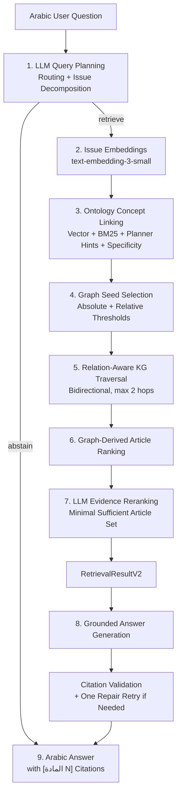

# Ontology-Driven GraphRAG for Arabic Legal Question Answering

An ontology-driven **GraphRAG framework for Arabic legal question answering over Jordanian Labor Law**.  
The system combines an RDF knowledge graph, hybrid semantic–lexical ontology concept linking, relation-aware graph traversal, LLM-based evidence reranking, and grounded Arabic answer generation with legal article citations.

> **Core retrieval principle:** semantic and lexical search are used only for ontology/KG concept linking. Legal article evidence can enter the answer context **only through knowledge-graph traversal**.

---

## Overview

Legal questions frequently require evidence that is not captured by surface-level textual similarity alone. This project represents Jordanian Labor Law as an ontology-aligned RDF knowledge graph and uses semantic graph structure to retrieve legal evidence before generating a grounded answer.

The framework separates the system into two stages:

- **Retrieval (`retrieval.v2`)** — plans the question, links it to ontology concepts, traverses the KG, ranks graph-derived articles, and selects legal evidence.
- **Generation (`generation.v2`)** — receives the completed retrieval object and generates an Arabic answer using only the retrieved statutory text.

The generation stage cannot query Weaviate, perform retrieval, or introduce additional legal articles.

---

## System Architecture



### Retrieval flow

For every atomic legal issue, the system:

1. uses the evaluated LLM to route and decompose the question;
2. creates an embedding for the issue representation;
3. searches only `retrievalEligible=true` semantic concept nodes;
4. combines:
   - semantic similarity,
   - BM25 lexical matching,
   - planner concept hints,
   - graph specificity;
5. selects high-confidence graph seeds;
6. traverses weighted semantic/evidence relations;
7. creates Article candidates **exclusively from graph traversal**;
8. ranks graph-derived Article candidates;
9. asks the same evaluated LLM to select the smallest sufficient evidence set.

### Generation flow

The generator receives the user question and the final graph-derived Article evidence only. It is instructed to use the supplied Article text as its **only legal evidence**, and any citation to an unretrieved Article is rejected.

---

## Knowledge Graph

The current Jordanian Labor Law KG contains approximately:

| Component | Count |
|---|---:|
| RDF triples | 4,758 |
| Nodes | 824 |
| Legal Articles | 142 |
| Paragraphs | 359 |
| Definitions | 22 |
| Retrieval-eligible semantic concepts | 212 |
| Semantically reachable Articles | 142 / 142 |

The KG is stored in Turtle/RDF format and ingested into Weaviate. Article and Paragraph nodes are **not retrieval-eligible** for vector/BM25 concept search.

---


## Supported LLM Providers

The pipeline supports multiple LLM backends through a shared structured-output interface. The evaluated setup can use OpenAI, Google, OpenCode-hosted models, and Cohere.

The same selected LLM is used for the LLM-dependent stages of the evaluated pipeline:

```text
Query planner
→ abstention verifier (when triggered)
→ evidence reranker
→ grounded answer generator
→ citation-repair retry
```

This enables controlled model comparison while keeping the rest of the GraphRAG architecture fixed.

---

## Experimental Evaluation

### Benchmark

The reported model comparison uses:

```text
data/benchmarks/jordan_labor_law_fresh_final_40_v3_1.json
```

The benchmark contains **40 Arabic questions**:

| Type | Questions |
|---|---:|
| Straightforward | 8 |
| Paraphrased | 8 |
| Typographical / noisy | 3 |
| Numerical | 5 |
| Colloquial | 5 |
| Multi-article | 7 |
| Out-of-scope | 4 |
| **Total** | **40** |

Behavior distribution:

- 36 in-scope retrieval questions
- 4 out-of-scope abstention questions

The benchmark is a balanced evaluation subset derived from the previously existing 120-question regression suite. It should therefore be treated as a **fixed regression/model-evaluation benchmark**, not as a pristine unseen holdout.

Each model was evaluated in **three independent runs**. Results are reported as mean ± sample standard deviation.

### Evaluation metrics

**Retrieval**
- Routing Accuracy
- Hit@1
- Article Recall@5
- Article Precision
- Out-of-Scope Accuracy
- Mean Retrieval Latency

**Generation**
- Correctness
- Faithfulness
- Citation Validity
- Citation Recall
- Out-of-Scope Response Accuracy
- Mean Generation Latency

**Overall**
- End-to-End Success Rate

Generation quality was evaluated with a fixed OpenAI judge model:

```text
gpt-5.4-mini
```

---

## Results

### Overall comparison

| Model | E2E Success | Routing | Hit@1 | Recall@5 | Precision | Correctness | Faithfulness | Citation Validity | Citation Recall |
|---|---:|---:|---:|---:|---:|---:|---:|---:|---:|
| **Gemini-3.5-Flash-Lite** | **93.33 ± 3.82%** | **99.17 ± 1.44%** | 91.67 ± 2.78% | **95.52 ± 1.49%** | **93.83 ± 2.07%** | **95.83 ± 3.67%** | **98.61 ± 1.39%** | 97.22 ± 2.78% | **95.99 ± 3.51%** |
| **Qwen3.7-Plus** | **90.83 ± 1.44%** | 97.50 ± 0.00% | 89.81 ± 1.60% | 92.59 ± 0.80% | 89.43 ± 0.71% | 92.13 ± 0.80% | 95.83 ± 2.41% | 96.30 ± 1.60% | 92.59 ± 0.80% |
| **GPT-5-nano** | **84.17 ± 2.89%** | 94.17 ± 1.44% | 87.04 ± 1.60% | 88.12 ± 3.99% | 83.95 ± 1.86% | 86.57 ± 2.89% | 90.74 ± 1.60% | 90.74 ± 1.60% | 88.12 ± 3.99% |
| **Aya Expanse 32B** | **79.17 ± 2.89%** | 89.17 ± 1.44% | **93.52 ± 3.21%** | 95.37 ± 2.12% | 86.11 ± 2.42% | 92.10 ± 4.42% | 92.08 ± 2.04% | **98.15 ± 1.60%** | 94.44 ± 5.01% |

### Latency

| Model | Retrieval Latency | Generation Latency |
|---|---:|---:|
| **Gemini-3.5-Flash-Lite** | **4.19 ± 0.04 s** | **1.01 ± 0.02 s** |
| GPT-5-nano | 8.77 ± 0.38 s | 2.97 ± 0.19 s |
| Aya Expanse 32B | 17.12 ± 0.44 s | 3.59 ± 0.10 s |
| Qwen3.7-Plus | 53.34 ± 1.58 s | 15.95 ± 0.89 s |

Latency values represent measured pipeline-stage latency and may include API/network/provider overhead; they are not isolated model-inference benchmarks.

### Main observations

- **Gemini-3.5-Flash-Lite** achieved the highest overall E2E success rate and the strongest performance/latency balance.
- **Qwen3.7-Plus** ranked second overall and showed stable retrieval/generation performance, but with substantially higher latency.
- **GPT-5-nano** provided lower latency than Qwen and Aya but lower overall retrieval and generation quality.
- **Aya Expanse 32B** achieved the highest Hit@1 and citation validity despite its lower overall E2E score. Its lower end-to-end score was driven primarily by routing/out-of-scope failures rather than weak graph retrieval.
- The results show that changing the LLM affects not only final answer generation, but also query planning, routing, concept linking through planner hints, evidence reranking, and structured-output reliability.

---


# Running the Project

## 1. Prerequisites

Recommended environment:

- Python 3.12+
- Docker / Docker Compose
- Weaviate
- An OpenAI API key for the fixed embedding model
- API credentials for the LLM provider you want to use

The pipeline requires OpenAI embeddings even when the evaluated LLM is Gemini, Qwen, Aya, or a local model.

---

## 2. Clone the repository

```bash
git clone <YOUR_REPOSITORY_URL>
cd <YOUR_REPOSITORY_DIRECTORY>
```

---

## 3. Create a Python environment

### Windows

```powershell
python -m venv .venv
.venv\Scripts\Activate.ps1
```

### Linux / macOS

```bash
python -m venv .venv
source .venv/bin/activate
```

Install the project dependencies using the dependency file included in the repository, for example:

```bash
pip install -r requirements.txt
```

---

## 4. Configure environment variables

Create a local `.env` file.

**Never commit `.env` or real API keys to GitHub.**

Example:

```env
# Pipeline LLM
PIPELINE_LLM_PROVIDER=openai
PIPELINE_LLM_MODEL=gpt-5-nano

# Fixed embedding provider
OPENAI_API_KEY=YOUR_OPENAI_API_KEY
OPENAI_EMBEDDING_MODEL=text-embedding-3-small

# Optional providers
GOOGLE_API_KEY=
OPENCODE_API_KEY=
COHERE_API_KEY=

# Weaviate
WEAVIATE_API_KEY=YOUR_WEAVIATE_API_KEY
WEAVIATE_HTTP_HOST=weaviate
WEAVIATE_HTTP_PORT=8080
WEAVIATE_GRPC_HOST=weaviate
WEAVIATE_GRPC_PORT=50051

# KG
KG_TTL_PATH=/app/data/jordan_labor_law_full_knowledge_graph.ttl

# Evaluation judge
EVALUATION_JUDGE_MODEL=gpt-5.4-mini
```

When running the Python API directly on the host instead of inside Docker, point the Weaviate host variables to the address exposed to the host, typically:

```env
WEAVIATE_HTTP_HOST=localhost
WEAVIATE_GRPC_HOST=localhost
```

and use a host-accessible KG path.

---

## 5. Start Weaviate

If the repository contains a Docker Compose configuration, start the services with:

```bash
docker compose up -d
```

Verify that Weaviate is healthy before ingestion.

The API itself also exposes:

```text
GET /health
```

to verify both the FastAPI process and the Weaviate connection.

---

## 6. Inspect the KG before ingestion

Optional but recommended:

```bash
python -m scripts.inspect_ttl
```

You can also run the reachability audit:

```bash
python -m scripts.audit_graph_reachability
```

The KG should report all 142 Articles as semantically reachable.

---

## 7. Ingest the KG into Weaviate

For a clean deterministic import:

```bash
python -m scripts.ingest_kg --reset
```

The ingestion process:

```text
TTL validation
→ RDF node/edge extraction
→ OpenAI node embeddings
→ Weaviate schema creation
→ Node ingestion
→ Edge ingestion
```

If collections already contain data, the ingestion script intentionally refuses to continue unless `--reset` is supplied.

---

## 8. Start the FastAPI application

For direct Python execution:

```bash
uvicorn app.main:app --host 0.0.0.0 --port 8000
```

The API will be available at:

```text
http://localhost:8000
```

Useful endpoints:

```text
GET  /
GET  /health
POST /retrieve
POST /generate
```

FastAPI interactive documentation is normally available at:

```text
http://localhost:8000/docs
```

---

## 9. Run retrieval only

```bash
python -m scripts.retrieve "ما المعلومات التي يرسلها صاحب العمل إلى وزارة العمل في بداية كل سنة؟" --debug
```

To save the `retrieval.v2` output:

```bash
python -m scripts.retrieve \
  "ما المعلومات التي يرسلها صاحب العمل إلى وزارة العمل في بداية كل سنة؟" \
  --output retrieval.json
```

---

## 10. Run generation from saved retrieval

This command **does not rerun retrieval**:

```bash
python -m scripts.generate_from_retrieval retrieval.json --output generation.json
```

This is useful when inspecting the strict boundary between evidence retrieval and answer generation.

---

## 11. Query the API directly

### Retrieval

```bash
curl -X POST "http://localhost:8000/retrieve" \
  -H "Content-Type: application/json" \
  -d '{
    "question": "ما المعلومات التي يرسلها صاحب العمل إلى وزارة العمل في بداية كل سنة، وما السجلات التي يجب أن يحتفظ بها داخل المؤسسة؟",
    "include_debug": true
  }'
```

The response is a `retrieval.v2` object.

### Generation

Send the **complete output of `/retrieve`** as the request body to:

```text
POST /generate
```

Example:

```bash
curl -X POST "http://localhost:8000/generate?include_debug=false" \
  -H "Content-Type: application/json" \
  --data-binary @retrieval.json
```

---

## 12. Run tests

```bash
pytest
```

The current tests include:

- architecture invariants;
- KG integrity and semantic Article reachability;
- exclusion of Article/Paragraph document nodes from concept linking;
- Arabic text normalization;
- statutory text relevance behavior.

---

# Reproducing the Model Evaluation

Before evaluation:

1. start the API;
2. ingest the same KG;
3. choose the evaluated pipeline model;
4. keep all non-model retrieval/generation settings fixed;
5. keep `text-embedding-3-small` fixed;
6. keep `gpt-5.4-mini` fixed as the evaluation judge.

Example environment:

```env
PIPELINE_LLM_PROVIDER=google
PIPELINE_LLM_MODEL=<GEMINI_MODEL_NAME>
EVALUATION_JUDGE_MODEL=gpt-5.4-mini
```

Run three independent repetitions:

```bash
python -m scripts.run_full_pipeline_evaluation \
  --benchmark data/benchmarks/jordan_labor_law_fresh_final_40_v3_1.json \
  --runs 3 \
  --output-dir data/model_evaluations/gemini
```

The evaluation runner writes:

```text
run-1.json
run-2.json
run-3.json
final-summary.json
```

`final-summary.json` reports mean and **sample standard deviation** across complete independent runs.

To compare another model, change only the evaluated provider/model configuration and rerun the same command with a separate output directory.

---

## Evaluation Integrity

The model-comparison runner checks that the configured LLM path was actually used. Infrastructure/provider failures are treated as execution failures instead of silently replacing the evaluated model with deterministic fallback behavior.

Gold Articles, required facts, required citations, forbidden claims, and scope labels are evaluation metadata only. Only the Arabic question is sent to the retrieval endpoint.

---

## Design Guarantees

The implementation includes explicit safeguards to preserve the intended architecture:

- Vector and BM25 search are restricted to semantic concepts.
- Article and Paragraph nodes are excluded from ontology concept linking.
- Legal Articles are introduced only by relation-aware graph traversal.
- Structural `hasArticle` catalogue traversal is disabled.
- The LLM reranker cannot select an Article outside the graph-derived catalogue.
- An empty reranker selection is valid when the graph provides insufficient evidence.
- The generation endpoint cannot rerun retrieval.
- The generator can cite only Articles supplied by retrieval.
- Invalid or unretrieved Article citations trigger validation and at most one repair retry.
- Failed citation validation results in `insufficient_evidence` rather than an unsupported answer.

---

## Research Use

This repository supports reproducible research on Arabic legal question answering, ontology-driven GraphRAG, legal knowledge graphs, grounded LLM generation, and model comparison.

The system provides legal-information answers over the represented Jordanian Labor Law KG and is not a substitute for professional legal advice.

---

## Citation

If you use this repository in academic work, please cite the associated paper.

```bibtex
@inproceedings{alqasem_ontology_graphrag,
  title   = {An Ontology-Driven GraphRAG Framework for Arabic Legal Question
             Answering over Jordanian Labor Law},
  author  = {Osama Alqasem, Omar Qawasmeh},
  year    = {2026},
  note    = {Bibliographic details to be updated after publication}
}
```

---


## Acknowledgements

This project investigates the integration of legal ontologies, RDF knowledge graphs, relation-aware retrieval, and large language models for Arabic legal question answering over Jordanian Labor Law.
