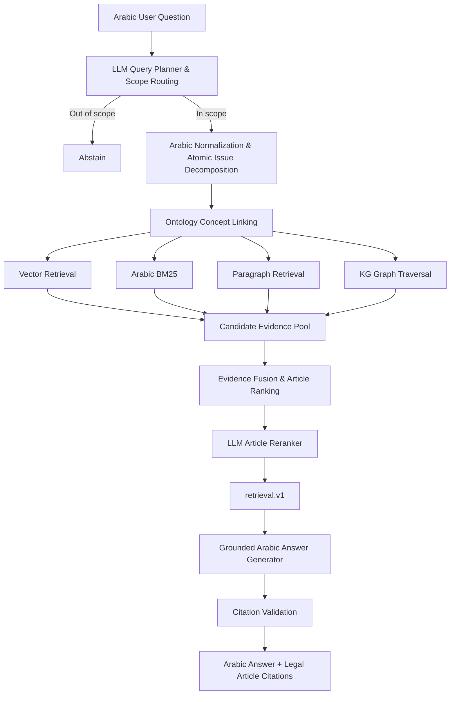

# Jordanian Labor Law Ontology-Driven GraphRAG

An Arabic legal question-answering research system that combines a domain ontology, an RDF Knowledge Graph, hybrid retrieval, graph traversal, and large language models (LLMs) to answer questions grounded in the **Jordanian Labor Law**.

> **Research status:** Experimental research prototype.  
> **Language:** Arabic legal questions and answers; English code/documentation.  
> **Domain:** Jordanian Labor Law.

---

## Overview

This repository implements an **ontology-driven GraphRAG pipeline** for Arabic legal question answering.

The system does not rely on an LLM's internal legal knowledge alone. Instead, each answer is grounded in a structured legal knowledge source consisting of:

- a Jordanian Labor Law domain ontology;
- the complete Arabic text of the law;
- an RDF/Turtle Knowledge Graph (KG);
- Weaviate-based semantic and lexical retrieval;
- explicit KG graph traversal;
- LLM-based query planning and article reranking; and
- evidence-grounded answer generation with article citations.

The repository also contains a controlled model-comparison experiment evaluating several LLMs under the same KG, retrieval architecture, embedding model, benchmark, and evaluation protocol.

---

## Research Questions

1. **To what extent can an ontology-driven GraphRAG framework support question answering over Jordanian Labor Law?**
2. **How does the choice of LLM affect retrieval and answer-generation performance within the same framework?**

---

## Key Features

- Arabic legal question answering over Jordanian Labor Law.
- Ontology-guided Knowledge Graph as the structured legal knowledge source.
- RDF/Turtle as the canonical KG representation.
- Weaviate materialization for vector, BM25, metadata, and graph-aware retrieval.
- Arabic query planning and scope routing.
- Atomic issue decomposition for complex and multi-part questions.
- Ontology concept linking before graph expansion.
- Hybrid retrieval using vector similarity, Arabic BM25, paragraph evidence, and KG graph traversal.
- LLM article reranking over a bounded legal candidate set.
- Grounded Arabic answer generation from the exact retrieval output.
- Citation validation against retrieved legal articles.
- Separate retrieval and generation evaluation.
- Three-run controlled comparison across multiple LLMs.

---

## System Architecture



The retrieval and generation stages are deliberately separated. The generator consumes the exact `retrieval.v1` output and does **not** perform an independent second retrieval.

---

## Knowledge Graph

### Construction

The Knowledge Graph was constructed from:

1. the project domain ontology; and
2. the complete text of the Jordanian Labor Law.

The ontology and law text were provided to **GPT-5.6 Sol through ChatGPT**, which was used as an ontology-guided KG construction assistant. The generated RDF graph was subsequently validated for structural consistency, article coverage, and preservation of the source legal text.

GPT-5.6 Sol was used for **KG construction only** and was not one of the LLMs evaluated in the downstream model-comparison experiment.

### Final KG Statistics

| Property | Value |
|---|---:|
| Legal articles covered | **142 / 142** |
| RDF triples | **3,694** |
| Paragraph/clause individuals | **359** |
| Definitions | **22** |
| Domain/canonical concepts | **61** |
| Canonical format | **RDF/Turtle** |

Canonical KG:

```text
data/jordan_labor_law_full_knowledge_graph.ttl
```

The Turtle file remains the project's source of truth.

---

## Weaviate Representation

The canonical RDF graph is materialized in Weaviate using two complementary storage roles.

### Legal Nodes

The vectorized node collection stores searchable legal objects such as:

- articles;
- paragraphs;
- ontology/domain concepts;
- labels and URIs;
- article numbers; and
- searchable Arabic text.

Searchable text is embedded using:

```text
text-embedding-3-small
```

The same node collection also supports Arabic BM25 retrieval.

### RDF Edges

A separate non-vectorized edge collection preserves RDF relations as source–relation–target records.

These edges support graph traversal over meaningful legal relations such as:

```text
hasArticle
hasParagraph
defines
regulates
regulatedBy
hasRight
hasObligation
hasCondition
resultsIn
supportedByArticle
```

Weaviate is used as the **retrieval/materialization layer**. The repository does not claim native OWL/RDFS reasoning inside Weaviate.

---

## Pipeline Stages

### 1. Arabic User Question

The system receives an Arabic legal question.

During benchmark evaluation, **only the question text is supplied to the pipeline**. Gold articles, required facts, expected behavior, and expected citations remain evaluation-only metadata.

### 2. Query Planning and Scope Routing

The selected LLM determines whether the question is:

- `retrieve` — answerable from the represented Jordanian Labor Law; or
- `abstain` — outside the represented legal domain.

For in-scope questions, the planner also produces a normalized Arabic question, atomic legal issues, focused retrieval queries, and relevant actors, conditions, and numbers when needed.

### 3. Atomic Issue Decomposition

Compound questions are decomposed into smaller independently retrievable legal issues. This is especially important for multi-article questions because a single full-question embedding can dilute individual legal sub-issues.

### 4. Ontology Concept Linking

The analyzed question is linked to ontology/KG concepts such as worker, employer, wage right, employment contract, obligation, violation, condition, or consequence. These concepts act as graph seeds.

### 5. Semantic Vector Retrieval

Question and issue text is embedded using the frozen `text-embedding-3-small` model and matched against legal nodes in Weaviate.

### 6. Arabic BM25 Retrieval

BM25 complements semantic retrieval by emphasizing exact legal terminology, names, numbers, and lexical matches.

### 7. Paragraph Evidence

Paragraph-level matches provide local legal context and can promote the associated parent article.

### 8. KG Graph Traversal

Ontology-linked concepts are expanded through selected RDF relations. Graph evidence can identify legally connected provisions even when their surface wording is not highly similar to the original question.

### 9. Evidence Fusion

Candidates from vector search, BM25, paragraph retrieval, and graph traversal are merged into a common evidence pool.

### 10. LLM Article Reranking

The evaluated LLM receives a bounded catalogue of candidate articles and selects the smallest sufficient legal evidence set. The final retrieval contract allows a maximum of **five articles**.

### 11. `retrieval.v1`

Retrieval produces a stable structured package containing the route decision, embedding metadata, selected articles, linked concepts, expanded concepts, graph diagnostics, and timing information.

### 12. Grounded Answer Generation

The same evaluated LLM generates the Arabic answer using only the retrieved legal evidence and includes relevant article citations.

### 13. Citation Validation

The pipeline verifies that citations correspond to retrieved legal evidence and measures coverage of required citations.

---

## Requirements

- Python 3.12
- Docker / Docker Compose
- FastAPI
- Weaviate
- API access for the selected LLM provider
- OpenAI API access for the fixed embedding model and evaluation judge

Runtime dependencies are defined in:

```text
requirements.txt
```

---

## Configuration

Create a local environment file:

```bash
cp .env.example .env
```

Do **not** commit `.env` or API keys.

Core configuration:

```env
OPENAI_API_KEY=...
WEAVIATE_API_KEY=...

PIPELINE_LLM_PROVIDER=...
PIPELINE_LLM_MODEL=...
```

Depending on the selected provider, configure its key as well, for example:

```env
GOOGLE_API_KEY=...
OPENCODE_API_KEY=...
COHERE_API_KEY=...
```

OpenAI remains required when another provider is used because embeddings and the fixed evaluation judge use OpenAI services.

---

## Setup

### 1. Clone the Repository

```bash
git clone https://github.com/osamaqsm/Kg-GraphRAG.git
cd Kg-GraphRAG
```

### 2. Start Weaviate

```bash
docker compose up -d weaviate
```

### 3. Validate and Ingest the KG

```bash
docker compose run --rm api python scripts/ingest_kg.py --reset
```

This command validates the Turtle KG, prepares the Weaviate collections, generates embeddings, and ingests the legal nodes and RDF edges.

### 4. Start the API

```bash
docker compose up -d api
```

### 5. Health Check

```bash
curl http://localhost:8000/health
```

Interactive FastAPI documentation is available at:

```text
http://localhost:8000/docs
```

---

## Basic Retrieval Test

```bash
docker compose exec -T api   python scripts/retrieve.py   "ما مدة الإجازة السنوية للعامل؟"
```

The output follows the `retrieval.v1` contract.

---

## Generation from Saved Retrieval

```bash
docker compose exec -T api   python scripts/generate_from_retrieval.py   /app/path/to/retrieval.json
```

This verifies the architecture constraint that generation consumes a retrieval package without rerunning retrieval.

---

## Final Evaluation Benchmark

The final experiment uses the frozen benchmark:

```text
data/benchmarks/jordan_labor_law_fresh_final_40_v2_3.json
```

SHA-256:

```text
547d4636800043e14cd9254b566cbcf6aabfc464f046c798011ea3edd72077c7
```

### Benchmark Composition

| Test type | Questions |
|---|---:|
| Straightforward | 8 |
| Paraphrased | 8 |
| Typo / noisy | 3 |
| Numerical | 5 |
| Colloquial | 5 |
| Multi-article | 7 |
| Out-of-scope | 4 |
| **Total** | **40** |

| Expected behavior | Count |
|---|---:|
| Retrieve | 36 |
| Abstain | 4 |

| Difficulty | Count |
|---|---:|
| Easy | 6 |
| Medium | 17 |
| Hard | 17 |

Only the Arabic question is sent to the pipeline. Gold evidence and evaluation metadata remain evaluation-only.

---

## Evaluation Protocol

The following components are held fixed during model comparison:

| Component | Fixed setting |
|---|---|
| Knowledge Graph | Same validated Jordanian Labor Law KG |
| Retrieval architecture | Same ontology-driven hybrid GraphRAG pipeline |
| Embedding model | `text-embedding-3-small` |
| Benchmark | Same frozen 40-question holdout |
| Evaluation judge | `gpt-5.4-mini` |
| Runs | 3 independent runs per model |

For each experiment, the selected LLM powers the LLM-dependent stages:

- query planning;
- routing-related model logic;
- article reranking;
- grounded answer generation; and
- citation retry.

---

## Evaluation Metrics

### Retrieval

- Routing Accuracy
- Hit@1
- Article Recall@5
- Article Precision
- Out-of-Scope Accuracy
- Retrieval Stage Latency

### Generation

- Correctness
- Faithfulness
- Citation Validity
- Citation Recall
- Out-of-Scope Response Accuracy
- Generation Stage Latency

### Primary Metric

The primary metric is **strict end-to-end (E2E) success**.

A case passes only when the complete pipeline satisfies the required routing, legal evidence, answer-quality, grounding, and citation conditions.

Results are reported as **mean ± sample standard deviation across three independent runs**.

---

## Reproducing the Model Evaluation

Set the required provider and model in `.env`, then recreate the API container:

```bash
docker compose up -d --force-recreate api
```

Run the three-run evaluation:

```bash
docker compose exec -T api   env PYTHONIOENCODING=utf-8   python scripts/run_full_pipeline_evaluation.py   --benchmark /app/data/benchmarks/jordan_labor_law_fresh_final_40_v2_3.json   --runs 3   --output-dir /app/data/model_evaluations/<provider__model>
```

The evaluator writes:

```text
run-1.json
run-2.json
run-3.json
final-summary.json
```

Use a separate output directory for each model.

---

## Final Model Comparison

Four models were evaluated:

1. GPT-5-nano
2. Gemini-3.5-Flash-Lite
3. Qwen3.7-Plus
4. Aya Expanse 32B — additional multilingual baseline

### Aggregate Results

| Metric | GPT-5-nano | Gemini-3.5-Flash-Lite | Qwen3.7-Plus | Aya Expanse 32B |
|---|---:|---:|---:|---:|
| **E2E success** | 81.67 ± 3.82% | 88.33 ± 5.20% | **90.83 ± 3.82%** | 69.17 ± 3.82% |
| Routing accuracy | **100%** | **100%** | **100%** | 90.00% |
| Hit@1 | 93.52 ± 3.21% | 93.52 ± 1.60% | **94.44 ± 2.78%** | 69.44 ± 4.81% |
| Recall@5 | **98.06 ± 1.23%** | 96.44 ± 1.47% | 96.94 ± 1.82% | 93.47 ± 1.93% |
| Retrieval precision | 85.90 ± 4.75% | **93.69 ± 0.97%** | 93.56 ± 3.19% | 49.65 ± 0.12% |
| Correctness | 91.20 ± 2.89% | 93.98 ± 3.50% | **95.83 ± 2.41%** | 87.14 ± 3.78% |
| Faithfulness | 90.74 ± 4.24% | 97.22 ± 3.67% | **98.15 ± 0.80%** | 91.90 ± 2.97% |
| Citation validity | **100%** | 99.07 ± 1.60% | 99.07 ± 1.60% | 99.05 ± 1.65% |
| Citation recall | **97.82 ± 1.54%** | 96.44 ± 1.47% | 96.94 ± 1.82% | 95.19 ± 3.63% |
| Retrieval latency | 23.88 s | **7.00 s** | 70.89 s | 22.23 s |
| Generation latency | 6.52 s | **1.24 s** | 19.73 s | 4.69 s |

Qwen3.7-Plus achieved the **highest observed mean E2E success rate**, while Gemini-3.5-Flash-Lite provided the strongest latency/performance balance.

No statistical-significance claim is made from only three runs.

> Latency values are pipeline-stage measurements and may include model inference, provider API, and network overhead.

---

## Multi-Article Performance

Multi-article questions remained the most difficult category.

| Model | Multi-article E2E |
|---|---:|
| GPT-5-nano | 57.14 ± 24.74% |
| Gemini-3.5-Flash-Lite | **66.67 ± 21.82%** |
| Qwen3.7-Plus | 61.90 ± 8.25% |
| Aya Expanse 32B | 33.33 ± 16.50% |

The main remaining systems challenge is **complete evidence-set retrieval for compound legal questions**.

---

## Official Result Files

Detailed per-question outputs and aggregate summaries are stored under:

```text
data/model_evaluations/fresh_final_v2_3/
```

Each official model directory contains:

```text
run-1.json
run-2.json
run-3.json
final-summary.json
```

Use the raw run files for per-question inspection and `final-summary.json` for aggregate mean/standard-deviation results.

---

## Reproducibility Notes

To preserve a fair comparison:

- the KG is fixed;
- the benchmark is fixed;
- the embedding model is fixed;
- the evaluation judge is fixed;
- retrieval parameters are held constant;
- the same model powers all LLM-dependent stages for a given experiment; and
- official results are stored separately for each model.

Model-generated structured-output or semantic-contract failures are counted as pipeline/task failures rather than silently replacing the evaluated model.

---

## Limitations

- The KG represents the version of Jordanian Labor Law used in this project; later amendments require an explicit KG update.
- The system is a research prototype and is **not a substitute for professional legal advice**.
- Multi-article questions remain substantially harder than most single-issue questions.
- LLM planning and reranking can vary across independent runs.
- Automated evaluation supports controlled comparison, but expert legal review remains important for real legal decision-support applications.
- Weaviate is used for retrieval and graph materialization; the system does not claim native OWL/RDFS inference within Weaviate.

---

## Security and Secrets

Never commit:

```text
.env
API keys
provider credentials
local secret configuration
```

Use `.env.example` for non-secret configuration templates and keep `.env` excluded through `.gitignore`.

---

## Authors

**Osama Alqasem**  
Data Science Department  
Princess Sumaya University for Technology  
Amman, Jordan

**Omar Qawasmeh**  
Data Science Department  
Princess Sumaya University for Technology  
Amman, Jordan  
Academic Supervisor

---

## Citation

This repository accompanies an ongoing research study on ontology-driven GraphRAG for Arabic legal question answering over Jordanian Labor Law.

A formal paper citation can be added once the conference-paper metadata is finalized.

For software citation, a `CITATION.cff` file can also be added to the repository root so GitHub can expose a built-in **Cite this repository** action.

---

## Disclaimer

This software is provided for research and experimental purposes.

Generated answers should not be interpreted as legal advice, legal representation, or an authoritative interpretation of Jordanian law.
